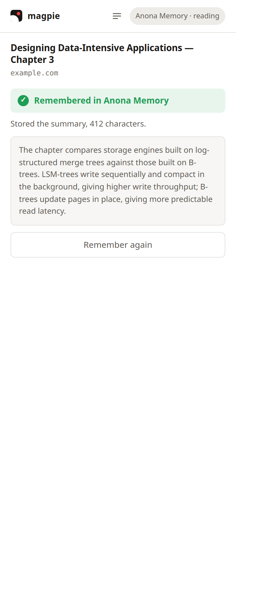

<h1 align="center">magpie</h1>

<p align="center">
  Remember any page into your memory layer — summarised on your own GPU.<br>
  The page text never leaves your machine.
</p>

<p align="center">
  <a href="LICENSE"></a>
  
  
</p>

<p align="center">
  
</p>

---

You press <kbd>Alt</kbd>+<kbd>Shift</kbd>+<kbd>M</kbd>. A model running on your own
GPU reads the page and writes a few sentences, and those few sentences go to your
memory layer. The article itself stays here.

Works with **[Anona Memory](https://anonalabs.com)**, **[Mem0](https://mem0.ai)**
and **[Supermemory](https://supermemory.ai)**.

## Contents

- [Quick start](#quick-start)
- [What leaves your machine](#what-leaves-your-machine)
- [Usage](#usage)
- [How it works](#how-it-works)
- [Models](#models)
- [Adding a memory layer](#adding-a-memory-layer)
- [Development](#development)
- [Troubleshooting](#troubleshooting)
- [Contributing](#contributing)
- [Security](#security)
- [License](#license)

## Quick start

Not on the Chrome Web Store yet, so it installs unpacked. You need Node 20+ and a
Chrome with WebGPU.

```bash
git clone https://github.com/anonalabs/magpie
cd magpie
npm install
npm run vendor:wasm   # the model libraries (17 MB) into src/vendor
npm run build
```

Then `chrome://extensions` → **Developer mode** → **Load unpacked** → pick `dist/`.

Open the popup, choose a memory layer, paste an API key. Your spaces load
themselves.

> [!IMPORTANT]
> After any change to permissions or commands you must **reload** the extension,
> not just rebuild. Chrome re-reads an unpacked extension's files on every load
> but caches its parsed manifest until reload, so a rebuilt extension can run new
> code against the old manifest.

## What leaves your machine

One request, to the memory layer you configured. Two modes, differing by a single
field:

| Mode | `content` | Measured | Needs |
|---|---|---|---|
| **Distil** (default) | the summary the local model wrote | ~345 characters | WebGPU, one model download |
| **Send page text** | the extracted article | ~93,000 characters | nothing |

That is roughly **270× the content**, and providers bill on what they extract. All
chunking and every model call happen locally and are free, so in distil mode a long
article costs the same at the provider as a short one.

```jsonc
POST https://api.anonalabs.com/v1/record
Authorization: Bearer anona_live_…

{
  "space_id": "reading",
  "content":  "The chapter compares storage engines built on…",
  "metadata": { "url": "…", "title": "…", "captured_at": "…", "source": "magpie" },
  "tags": ["magpie"],
  "async": true
}
```

No telemetry, no analytics, and no magpie server. API keys live in
`chrome.storage.local` — deliberately not `chrome.storage.sync`, which would
replicate them to your Google account.

## Usage

| | |
|---|---|
| <kbd>Alt</kbd>+<kbd>Shift</kbd>+<kbd>M</kbd> | Remember this page. No prompt. |
| <kbd>Alt</kbd>+<kbd>Shift</kbd>+<kbd>N</kbd> | Remember it with a note. Compose starts the summary as it opens, so you write while the model runs. |
| Right-click a selection | Remember that passage, verbatim. No model. |
| Toolbar button | The same as the shortcut, plus history and settings. |
| In-page button | Optional, off by default — see [permissions](#permissions). |

**History** groups captures as *Needs you*, *Waiting to send* and *Remembered*, each
row with retry, delete and the reason it failed.

### Permissions

| Permission | Why |
|---|---|
| `activeTab`, `scripting` | Read the article of the page you explicitly ask to remember. |
| `storage`, `unlimitedStorage` | Your settings and key locally; the model weights in the browser cache. |
| `offscreen` | WebGPU is unavailable in a service worker, so the model runs in an offscreen document. |
| `alarms` | Retry a failed write after the worker has been killed. |
| `contextMenus` | *Remember this selection*. |
| Host access to the three provider APIs and `huggingface.co` | Send the memory; download the model weights once. |
| *Optional* `http://*/*`, `https://*/*` | Only for the floating in-page button, requested when you switch it on. |

## How it works

```
Alt+Shift+M · Alt+Shift+N · toolbar · in-page button · right-click a selection
      │
      ▼
service worker ──── is it a PDF? ──▶ offscreen: fetch and parse with pdf.js
      │                                        │
      ├── article ─▶ inject Readability ───────┤
      │                                        ▼
      │                              distil ─▶ chunk, summarise, fold
      │                              raw / selection ─▶ take the text as it is
      │                                        │
      └────────────── write to disk ◀──────────┘
                            │
                            ▼
                    send to your memory layer  (retry if it fails)
```

<details>
<summary><b>The parts that are load-bearing</b></summary>

**The offscreen document owns the job, not the service worker.** A worker dies
after 30s idle and is capped at 5 minutes per event; a long article exceeds both.
Measured before anything was built — see [`spikes/phase0`](spikes/phase0).

**Nothing is lost.** A capture is written to disk *before* any network call, so an
unreachable provider or an expired key is a retry rather than lost work. Retries
back off 30s → 2m → 10m → 1h → 6h, scheduled with `chrome.alarms` so they outlive
the worker. Failures that will never succeed — a rejected key, a refused body —
stop immediately and land in *Needs you* with the reason. A landed capture drops
its content and keeps only metadata.

Retrying a timeout or 5xx can write twice, since such a failure may already have
landed. magpie retries anyway: losing a capture is worse than duplicating one, and
duplicates are visible in history. A deliberate choice, not an oversight.

**The engine's lifecycle is its own tested module**
([`src/lib/engine-pool.js`](src/lib/engine-pool.js)) with `create` injected, so it
can be tested without a GPU. Three rules it enforces: the engine is a promise, not
a variable that will be set soon; teardown and rebuild are serialised, because
unloading in parallel with a load tears down the replacement; and a queued request
resolves the engine when it *runs*, never when it was queued.

**Chunking is measured in tokens, not characters.** A flat `length ÷ 4` runs 43%
low on code and 54% low on URL-dense text, and under-counting overfills the context
window — which returns an *empty summary* rather than an error. Nothing depends on
the estimate being right either: an empty answer is retried on half the input.

**The model libraries ship inside the extension.** WebLLM fetches its compiled
`.wasm` kernels from a CDN by default, and Chrome counts a remotely-fetched `.wasm`
as remotely-hosted code — a flat Web Store rejection. `npm run check:remote` fails
the build if a CDN code URL reappears.
</details>

### What it can read

**Articles**, via Mozilla's Readability, parsed from a clone so the page you are
looking at is not rearranged.

**PDFs**, which Chrome renders in a viewer no content script can enter — magpie
fetches and parses the file itself, up to **40 pages**, and says so *in the content*
when it stops there. Scanned PDFs need OCR and are refused with that reason;
`file://` PDFs need *Allow access to file URLs*.

**Selections**, stored exactly as selected — no model, instant, works without
WebGPU. The full selection is read from the page rather than from the context-menu
event, because Chrome truncates the copy it puts there.

## Models

| Model | Video memory | Context | For |
|---|---|---|---|
| Gemma 3 1B | 711 MB | 4,096 | integrated graphics |
| Qwen 2.5 1.5B | 1,630 MB | 4,096 | a good default |
| Llama 3.2 3B | 2,264 MB | 4,096 | best summaries |

Weights download once and are cached. A GPU that keeps faulting is almost always
short of memory, and retrying does not reduce memory pressure — so the recovery
offers the next model down and says how much it saves.

## Adding a memory layer

One file in [`src/lib/providers/`](src/lib/providers/) exporting `fields`,
`buildRequest` and `parseResponse`, then register it in `registry.js`. The
manifest's `host_permissions` are generated from `PROVIDER_ORIGINS` there, so a new
provider cannot ship with an unreachable host.

A field may also declare `loadOptions(config)` and the popup turns it into a picker.
Anona lists spaces; Mem0 lists users, filtered to `type === "user"` because the
endpoint named "get users" returns agents and runs too. Supermemory has none
deliberately — nothing enumerates container tags, since a tag starts existing when
it is used.

Report honestly: if the API accepts a write for asynchronous processing, return
`state: 'queued'`, not stored.

## Development

```bash
npm run verify      # build, remote-code gate, unit tests, end-to-end tests
npm run watch       # rebuild dist/ on change
npm test            # 118 unit tests
npm run test:e2e    # 67 end-to-end, driving a real Chrome
npm run shot        # screenshot a page of the built extension
npm run spike       # the phase-0 architecture probes
npm run package     # the Chrome Web Store zip
```

`test:e2e` points `api.anonalabs.com` at a local HTTPS server with
`--host-resolver-rules`, so the request under test is the one the extension would
really send. Nothing inside the extension is stubbed, and the harness generates a
real PDF by hand rather than depending on a library to test a library.

`npm run check:remote` has a positive control: it is verified to still fail on a
planted CDN `.wasm` before its passing result is trusted.

Design notes for each piece are kept in
[`docs/superpowers/specs/`](docs/superpowers/specs/), and
[`docs/publishing.md`](docs/publishing.md) covers the Web Store listing, and
[`docs/deploying-the-site.md`](docs/deploying-the-site.md) the install page.

## Troubleshooting

| Symptom | Cause |
|---|---|
| A permission cannot be granted | Chrome caches the manifest — reload the extension, not just the build. |
| The shortcut does nothing | Check `chrome://extensions/shortcuts`. Chrome silently declines a key it has reserved. |
| `gpu_fault` twice in a row | Real GPU memory pressure. Switch to a smaller model. |
| Nothing to remember on this page | The page is not an article. Readability found only boilerplate. |
| A capture is stuck in *Needs you* | A terminal failure — the row names it. Fix and retry. |

## Contributing

Issues and pull requests are welcome. See
[CONTRIBUTING.md](CONTRIBUTING.md) for how to run the suite and what a change needs
to land, and [CODE_OF_CONDUCT.md](CODE_OF_CONDUCT.md).

## Security

Please do not open a public issue for a vulnerability. See
[SECURITY.md](SECURITY.md), or write to
[support@anonalabs.com](mailto:support@anonalabs.com).

## License

[MIT](LICENSE). Bundles Mozilla's [Readability](https://github.com/mozilla/readability)
(MPL-2.0) and [pdf.js](https://github.com/mozilla/pdf.js) (Apache-2.0), and
[WebLLM](https://github.com/mlc-ai/web-llm) (Apache-2.0).
